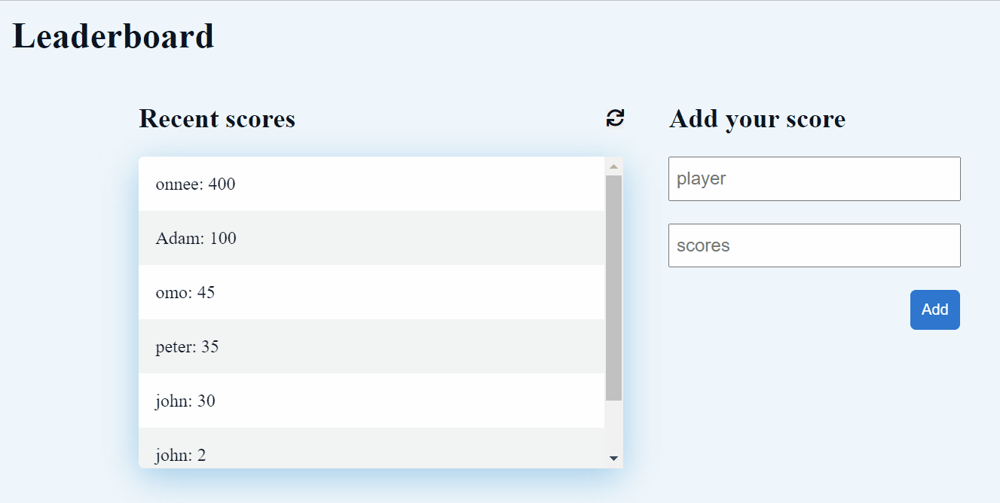
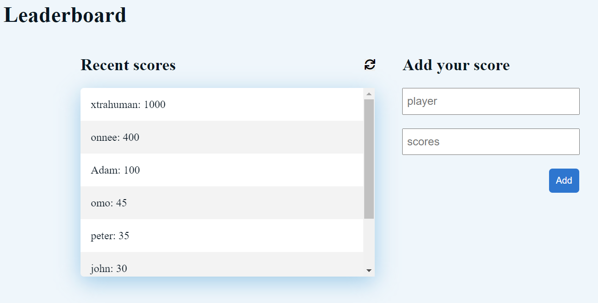

# leaderboard-project

## Description
> The leaderboard website displays scores submitted by different players. It also allows you to submit your score. All data is preserved thanks to the external Leaderboard API service.

Demo view                                |  static view
:---------------------------------------:|:---------------------------------------:
              |  

## Built With

- html
- css
- javascript
- webpack

## Procedure to clone project
- open your terminal
- type git clone https://github.com/xtrahuman/leaderboard-project.git
- type cd leaderboard-project to change directory to the folder of the project
- in your terminal, type 'npm install' to install app dependencies
- 'npm run build' in your terminal to build the project.
- navigate to index.html inside the dist directory
- open with live server, type 'npm run start' in your terminal.

## project link
click on the website to view project

- link to website: [click here](https://xtrahuman.github.io/leaderboard-project/)

## Author 1

👤 **Okpara Tochukwu**

- GitHub: [@xtrahuman](https://github.com/xtrahuman)
- LinkedIn: [LinkedIn](https://linkedin.com/in/tochukwu-okpara-449528197)

## 🤝 Contributing

Contributions, issues, and feature requests are welcome!

Feel free to check the [issues page](../../issues/).

## Show your support

Give a ⭐️ if you like this project!

## 📝 License

This project is [MIT](./MIT.md) licensed.

